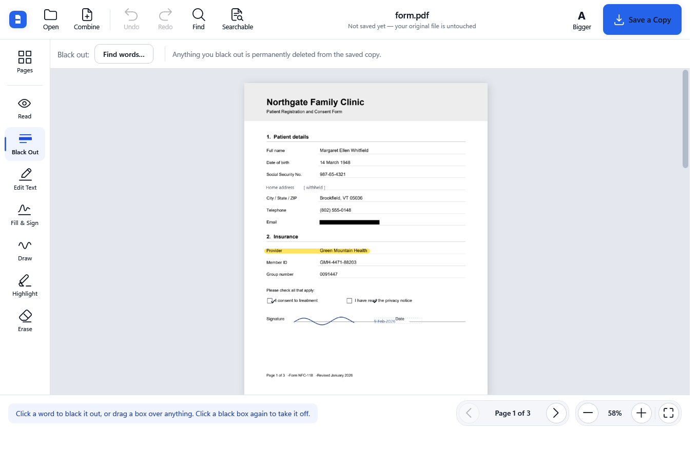

# Prime PDF

A PDF editor built for people who do not use computers much. One window, large
labelled buttons, plain-English instructions, and no way to accidentally destroy the
file you started with.

Redaction that genuinely deletes the text, fill-and-sign, page organising, and OCR for
scans — all offline, with no account, no upload and no subscription.

[](LICENSE)




> **Status:** works end to end and is covered by 92 automated assertions, but it has not
> yet been through a wide range of real-world PDFs. Treat it as early. Bug reports with a
> sample file are the most useful thing you can send.

## What it does

| | |
|---|---|
| **Open** | Any PDF, including password-protected ones. Drag a file onto the window, or use the big Open button. |
| **Combine** | Add the pages of other PDFs onto the end of the current one. |
| **Pages** | Thumbnails you can drag to reorder. Rotate, duplicate, delete, or save a selection as its own new file. |
| **Black Out** | Click a word to redact it, or drag a box. Click a black box again to lift it off. Removes the text for real — see below. |
| **Edit Text** | Click a line of text and retype it. Click your change again to correct it. The old wording is deleted, not covered over. |
| **Fill & Sign** | Type into blanks, tick checkboxes, and place a signature you draw, type, or import once and reuse. |
| **Draw / Highlight** | Freehand pen and translucent highlighter, with colour and thickness. |
| **Erase** | Removes anything you added. Never touches the original page content. |
| **Find** | Search the whole document and black out every match in one step. |
| **Searchable** | Runs OCR over scanned pages and writes an invisible text layer into the saved file, so it can be searched and copied from in *any* PDF reader. |
| **Save a Copy** | Always writes a new file. |

Also: Undo/Redo, zoom and fit, page navigation, and a "Bigger" button that scales the
entire interface for anyone who finds the default too small. On first run it offers to
become the computer's PDF reader.

All pages scroll in one column, the wheel moves through the document, and only pages you
actually edit are ever rewritten.

## Redaction actually removes the text

This is the part most "redaction" tools get wrong. Drawing a black rectangle over a
word leaves the word sitting in the file underneath — anyone can select it, copy it,
or pull it out with a script.

Here, **any page you edit is rasterised on save**. The saved page is an image of what
you saw, so a blacked-out word has no text object left to recover. Pages you did not
touch are copied across untouched, so they keep their selectable text and the file
stays small.

The test suite asserts this directly rather than taking it on trust — after redacting
`123-45-6789`, it scans the **raw bytes of the output file** and requires the string to
be absent:

```
=== Redaction removes the underlying text ===
  PASS  SSN digits are gone from page 1
  PASS  page 1 has no extractable text at all
  PASS  untouched page 2 keeps its text
  PASS  redacted area renders solid black
  PASS  SSN string absent from raw file bytes
```

The trade-off is deliberate but narrow: only a page that genuinely hides something is
rasterised, and only that page. Signing, ticking and annotating leave the original page —
and its searchable text — completely intact. The confirmation dialog says in plain words
what happened after saving.

## Why an edited file gets bigger — and how much

Redacting properly means the page can no longer be a set of text instructions, because
those instructions are exactly what has to disappear. That page becomes an image, and an
image of a page is simply larger than the handful of drawing commands it replaces. A
6 KB vector form that gets one word blacked out lands around 130 KB.

What should *not* cost that is signing or annotating, because nothing needs to be
destroyed. Pages carrying only additive marks — ink, signatures, ticks, added text — now
keep their original content and get a small transparent overlay covering just the marked
area. Same painter, so it looks identical; the page keeps its selectable text.

| action on one page | before | now |
|---|---|---|
| add a signature | 164 KB | **7 KB** |
| black out a word | 313 KB | **~130 KB** |

The redaction figure came down by lowering the raster default from 300 DPI/quality 92 to
200/80 and encoding colourless pages as grayscale. Only pages that genuinely hide
something are rasterised, and only those pages.

## Reading and scrolling

Every page sits in one scrolling column, so the wheel moves through the whole document
and the page arrows are a convenience rather than the only way to travel. **Ctrl+wheel
zooms**, matching Acrobat and every browser.

Zoom steps on fixed stops — 25, 33, 50, 67, 75, 85, **100**, 125, 150 and up — so 100%
is always reachable from either direction. A plain multiplier makes the stops depend on
wherever the fit landed, and sails straight past the one value people actually want.

Only pages near the viewport are rasterised, and their bitmaps are released once they
scroll well clear, so a long document costs a few page renders rather than one per page.

## Scanned pages

A scan is a picture of text. There is nothing to click, nothing to correct, and Find
comes back empty — which looks like the app is broken rather than like the document is
different. So when a scanned page is opened, the app offers to read it:

> **This page is a scan.** There is no text on this page for the app to find — it is a
> picture. Shall I read it so you can click on words? It takes a few seconds.

Recognition uses the OCR engine **built into Windows** (`Windows.Media.Ocr`), chosen
over bundling something like Tesseract because it needs no extra download, works with
no internet connection, and uses whatever language packs the machine already has.
Roughly 200 ms per page on this hardware.

The recognised words are written into the *same word index* the editor already uses for
embedded text, so click-to-redact, Edit Text and Find all start working on scans with no
further special-casing.

**Searchable output.** The toolbar's *Searchable* button reads every scanned page and
writes the words into the saved file as invisible text — rendering mode 3, positioned
over the picture, using the standard Helvetica so nothing has to be embedded. The page
looks identical, the file grows by a few kilobytes, and the result is searchable in
Acrobat, a browser, or anything else. A three-page scan gained a full text layer for
about 5 KB.

One rule that layer must obey: **words under a redaction are dropped.** Recognised text
is the one path that could quietly put a blacked-out word back into the file in a
searchable form, undoing the most important thing this program does. There is a test
asserting exactly that, down to scanning the raw output bytes.

The self-test draws every recognised box back onto the page to prove the coordinates line
up rather than merely parse:

```bash
PrimePdf.exe --ocr-test scanned.pdf overlay.png
```

## Becoming the default PDF reader

On first run the app asks whether PDF files should open here, and remembers the answer
either way so it never asks twice. It can also be reached later from the start screen.

Worth being precise about what happens, because it is a common source of bad behaviour
in Windows apps: **since Windows 8 an application cannot make itself the default handler
on its own.** The association Windows honours lives under a key validated with an
undocumented hash, and writing it directly gets detected and reset. Apps that claim
otherwise are either hijacking that key or quietly failing.

So this does the half that is legitimate — registering the ProgId, icon, supported types
and capabilities under `HKEY_CURRENT_USER`, no administrator rights needed — and then
opens the Windows chooser for the user to confirm with one click. Registration only adds
the app as a *candidate*; it never changes the existing default by itself.

For scripted deployment:

```bash
PrimePdf.exe --register
PrimePdf.exe --unregister
```

## Running it

A self-contained build needs nothing installed, not even .NET:

```bash
dotnet publish src/PrimePdf/PrimePdf.csproj -c Release -r win-x64 --self-contained true -p:PublishSingleFile=true -p:IncludeNativeLibrariesForSelfExtract=true -p:EnableCompressionInSingleFile=true -o publish/PrimePdf
```

That produces a single `PrimePdf.exe` (~73 MB) which can be copied to any Windows x64
machine and double-clicked.

To run from source:

```bash
dotnet run --project src/PrimePdf
```

## Security

The app's whole job is opening files sent by other people, so untrusted PDF input is the
threat model that matters.

**Confirmed absent, by inspection of the source rather than assumption:**

| | |
|---|---|
| **SSRF** | No `HttpClient`, `WebClient`, `WebRequest` or socket anywhere in the code. Neither PDFium nor PdfPig performs network I/O, and the app never follows a link or remote reference out of a PDF. |
| **Command injection** | No data derived from a PDF ever reaches a process launch. The only two `Process.Start` calls take a compile-time constant (`ms-settings:`) and a directory path, both via `UseShellExecute` with no command line of our own construction. |
| **PDF JavaScript** | The bundled PDFium contains no `v8::`, `FXJS_`, `CJS_Runtime` or `XFA_` symbols — the JavaScript and XFA engines are not compiled in, so script in a PDF cannot execute. This removes the largest single remote-code-execution vector for a PDF renderer. |
| **Unsafe deserialization** | Only `System.Text.Json` on a local settings file, into a sealed type with three scalar properties. No polymorphic binding; `BinaryFormatter` is disabled in the runtime config. |
| **SQL / XML injection** | No database and no XML parsing in app code. |

**The residual risk is PDFium itself.** It is native C++ parsing hostile input, and it has
had memory-safety CVEs. Nothing in a managed wrapper changes that. The mitigations that
apply are: no scripting engine compiled in (above), keeping `PDFtoImage`/`bblanchon.PDFium`
current, and — for a genuinely hardened deployment — running the process with reduced
privileges or in an AppContainer. That last one is not done here and is the main thing I
would add before treating this as safe against a targeted attacker.

One crash worth recording, because it shows what the two test suites are for: setting
`InvariantGlobalization` to trim the build left every headless test and screenshot
passing, then threw *"1033 is an invalid culture identifier"* the moment anyone used the
app — and because the close confirmation itself failed, the window could not be closed.
The setting is gone, the closing path can no longer be blocked by a failing dialog, and
repeated identical errors now stop interrupting and offer to quit instead of stacking up.

**Fixed during the audit:**

- **Memory exhaustion from a crafted page.** PDF permits pages up to 200 inches square. At
  the 300 DPI export default that is ~3.6 gigapixels — about 14 GB — requested by a file a
  few hundred bytes long, and OCR is *offered automatically* on scanned pages, so the path
  was reachable with one click. Every render now funnels through one pixel ceiling
  (`PageRenderer.MaxRenderPixels`, 40 MP), which covers display, export, thumbnails and OCR
  together. Normal pages are untouched by it.
- **Unsynchronised access to a non-thread-safe native library.** Export runs on a background
  thread with its own renderer while the editor may still be drawing thumbnails on the UI
  thread. Concurrent PDFium calls corrupt native state rather than raising an exception. All
  entries into PDFium, from every renderer instance, are now serialised through one lock.
- **Stalling on page count.** Every page was parsed at open time purely to measure it, so a
  file declaring a large page count froze the app before showing anything. Sizes are now
  read on demand, with a fallback for pages that will not parse.
- **Process arguments built by string concatenation.** "Show me the file" spliced a path into
  an `explorer.exe /select,"..."` command line. Not exploitable — Windows file names cannot
  contain a quote — but it is the shape of an argument-injection bug, so it now goes through
  `SHOpenFolderAndSelectItems` and passes no command line at all.

Malformed input is covered by tests: empty files, non-PDF content, truncated files, headers
with no body, and pages declaring a zero-sized box all fail safely rather than crashing.

## Tests

```bash
dotnet run --project tests/EngineTests   # 56 engine assertions, headless
PrimePdf.exe --selftest sample.pdf        # 25 interface assertions
```

Two suites, because they catch different things. The engine tests run headless and cover
redaction, export, geometry and hostile input. The self-test drives the interface —
building every dialog, selecting every tool, opening a document — and exists because of a
real escape: trimming globalization data out of the build left every headless test and
screenshot passing exactly as before, then threw *"1033 is an invalid culture identifier"*
the moment a person touched the app. Headless assertions could not see it.

The engine suite covers redaction, lossless pass-through of untouched pages, combining,
reordering, deletion, rotation (including that marks rotate with their page), undo and
redo, phrase search across word boundaries, every mark type surviving a save, oversized
and malformed input, and concurrent render/export. The geometric tests work by exporting
a real PDF, re-rendering it, and probing pixels.

To generate the sample form used in the screenshots:

```bash
dotnet run --project tests/EngineTests -- --sample "sample.pdf"
```

## How it is put together

```
src/PrimePdf.Core/     engine, no UI dependency, testable headless
  Geometry.cs         PtRect and the base <-> display rotation transform
  Marks.cs            one class per kind of edit
  PdfSource.cs        an opened file: page sizes, word boxes, PDFsharp handle
  DocumentModel.cs    ordered pages drawn from any number of sources, undo
  PageRenderer.cs     PDFium rasterisation with an LRU cache
  MarkPainter.cs      draws marks — used by both preview and export
  TextSearch.cs       phrase matching across word boundaries
  Exporter.cs         copy clean pages, rasterise edited ones
src/PrimePdf/          WPF application
  Ocr/OcrService.cs   Windows OCR, feeding recognised words into the shared index
  Shell/              per-user file-association registration
tests/EngineTests/    assertions plus the sample-document generator
```

Note that OCR lives in the app rather than the engine: it is the one Windows-only piece,
and keeping it out of `PrimePdf.Core` is what lets the engine stay `net10.0` and testable
without a desktop.

Three libraries do the heavy lifting: **PDFium** (via `PDFtoImage`) rasterises,
**PdfPig** reports where the words are, and **PDFsharp** writes the output.

Two decisions carry most of the weight:

**One painter for preview and export.** `MarkPainter` is the only code that draws a
mark, and the exporter calls it at a higher DPI. There is no second rendering path that
could drift, so what the user sees while editing is what lands in the file.

**Marks are stored in the page's own coordinate space**, in points, with the top-left
as the origin. Rotating a page therefore never rewrites a single mark — the rotation is
applied at draw time. `PageTransform` converts both ways and is round-trip tested.

### On coordinates

PdfPig and PDFium have to agree on where a word is, or clicking one would redact the
wrong thing. Empirically (see the round-trip test): PdfPig already applies the page's
`/Rotate` and subtracts the `CropBox` origin, so its coordinates match PDFium's
rendered output directly, needing only a y-flip and a points-to-pixels scale.

One trap: on rotated pages `PdfRectangle.Left`/`Top`/`Right`/`Bottom` come back
scrambled (`Left` can exceed `Right`). `PdfSource.Words` normalises across all four
corner points instead of trusting those accessors.

## Limitations

- **Redacting a page turns it into an image.** Intentional (see above), but that page is
  no longer searchable and the file grows. Signing and annotating do not do this.
- **Marks cannot be moved or resized once placed.** Erase and place it again. Undo also
  works. This keeps the interaction model to "click or drag, done".
- **OCR quality is the Windows engine's.** It is good on clean printed scans and poor on
  faint or handwritten ones. It does not correct a page that was scanned sideways, and
  recognised text is used for selection only — it is never written into the saved file.
- Encrypted PDFs are opened with a supplied password but are always saved unencrypted.

- **Windows only.** The engine (`PrimePdf.Core`) targets plain `net10.0` and has no
  Windows dependency, so a port would start from a working, tested core — but the
  interface is WPF and OCR uses a Windows API.

## A note on dependencies

`UglyToad.PdfPig` on nuget.org is **not** the real PdfPig package — it has two odd
prerelease versions and is a name-squat on the genuine package, which is published as
`PdfPig` (the `UglyToad` part is the namespace). This project uses `PdfPig` 0.1.15.

If you are adding PdfPig to your own project, check which one you are installing.

## Contributing

Issues and pull requests are welcome. Two things make a change much easier to accept:

**Send a sample PDF with a bug report.** Almost every interesting bug in this codebase
came from a specific document doing something unexpected. A file beats a description.

**Add the assertion that would have caught it.** There are two suites and they catch
different classes of problem:

- `tests/EngineTests` runs headless and covers redaction, export, geometry and hostile
  input. Geometric tests export a real PDF, re-render it and probe pixels.
- `PrimePdf.exe --selftest <file.pdf>` drives the interface — every dialog, every tool,
  the wheel, the zoom ladder. It exists because two real bugs shipped past a fully green
  headless suite: one trimmed globalization data and threw on first interaction, the
  other lost the DPI manifest and blurred the whole window on scaled displays. Neither
  was visible without actually starting the application.

Both must pass before a change lands.

## Licence

MIT — see [LICENSE](LICENSE).

Bundled third-party components and their licences are listed in
[THIRD-PARTY-NOTICES.md](THIRD-PARTY-NOTICES.md). They are all permissive, but PDFium
and Skia are BSD-3-Clause, which requires their notice to travel with any binary you
distribute.
